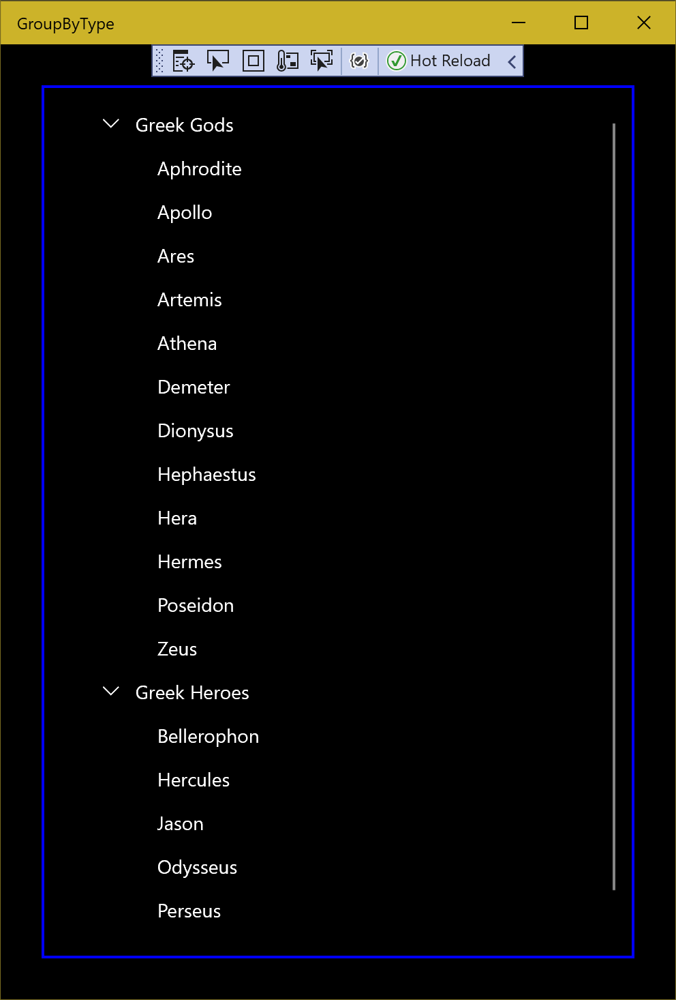
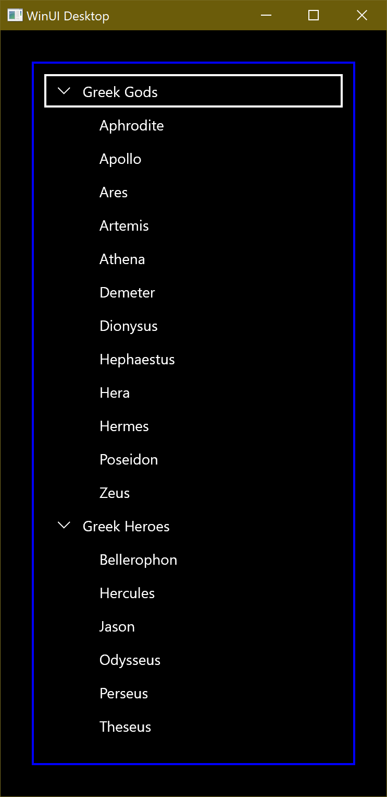

# How to implement custom grouping

My previous post shows how to group items based on the value of a certain property. In a real-world scenario you may want to group your items based on some other logic. With this in mind, WPF Data Binding provides a way for you to write custom code and specify how you want to group your items. This allows maximum flexibility; you can group your items pretty much any way you can think of.

In this post I'll look at how to group items based on their type and an example of how to do custom Grouping. 

My data source in this sample is of type ObservableCollection&lt;object&gt;, and contains some objects of type GreekGod and others of type GreekHero. My goal is to group all the items of type GreekGod in a group called "Greek Gods" and group all GreekHero items under the group "Greek Heroes". This is what the markup looks like:

	<Window.Resources>
		<local:GreekGodsAndHeroes x:Key="GodsAndHeroes" />
		<local:GroupByTypeConverter x:Key="GroupByTypeConverter"/>
	
		<CollectionViewSource x:Key="cvs" Source="{Binding Source={StaticResource GodsAndHeroes}}">
			<CollectionViewSource.GroupDescriptions>
				<PropertyGroupDescription Converter="{StaticResource GroupByTypeConverter}"/>
			</CollectionViewSource.GroupDescriptions>
		</CollectionViewSource>
	</Window.Resources>

Notice that this time, instead of setting PropertyName in PropertyGroupDescription, I set the Converter property. This Converter is defined in the code behind and contains the logic to divide the data items in groups.

	public class GroupByTypeConverter : IValueConverter
	{
		public object Convert(object value, Type targetType, object parameter, CultureInfo culture)
		{
			if (value is GreekGod)
			{
				return "Greek Gods";
			}
			else if (value is GreekHero)
			{
				return "Greek Heroes";
			}
			return null;
		}
	}

All the items that return the same value in the Converter will be grouped together. In this scenario I am grouping the items based on their type and my groups are of type string. Remember that you can use a Converter to group your items some other way. Notice also that the groups don't have to be a string, they can be any object you want.

Just like in the previous post, I want to display the groups and items in a TreeView.

	<TreeView ItemsSource="{Binding Source={StaticResource cvs}, Path=Groups}" Width="200">
	</TreeView>

In this case, however, templating the items is not as obvious. When the items are all of the same type this is really easy to achieve with a chain of HierarchicalDataTemplates and a DataTemplate for the leaf nodes. In this scenario we need a HierarchicalDataTemplate for the groups and one of two DataTemplates for the leaf nodes, depending on their type. 

My first approach to this was to have those 3 templates in the resources and set their DataType property instead of giving them a key (with x:Key). This does not work because when you use a HierarchicalDataTemplate to template a group and do not set its ItemTemplate property, that same template is used for the lower levels of the hierarchy. This behavior is useful when all the levels have items of the same type (for example, when using a TreeView to display a hierarchy of directories in a computer).

My second approach was to set the ItemTemplateSelector property of the HierarchicalDataTemplate to a template selector that decides the correct template to use based on the type of the leaf item. Unfortunately there is a bug in the ItemTemplateSelector property of HierarchicalDataTemplate that prevents this from working. Once the bug is fixed, this will be the correct way to specify the templates.

My third and final approach was to move the template selector to the TreeView and add one more "if" branch to deal with deciding what type to return for the groups (which are of type CollectionViewGroup).

	public override DataTemplate SelectTemplate(object item, DependencyObject container)
	{
		string templateKey;
		if (item is CollectionViewGroup)
		{
			templateKey = "GroupTemplate";
		}
		else if (item is GreekGod)
		{
			templateKey = "GreekGodTemplate";
		}
		else if (item is GreekHero)
		{
			templateKey = "GreekHeroTemplate";
		}
		else
		{
			return null;
		}
		return (DataTemplate)((FrameworkElement)container).FindResource(templateKey);
	}
	
	<Window.Resources>
		<local:GodHeroTemplateSelector x:Key="GodHeroTemplateSelector" />
		(...)
	</Window.Resources>
	
	<TreeView ItemsSource="{Binding Source={StaticResource cvs}, Path=Groups}" ItemTemplateSelector="{StaticResource GodHeroTemplateSelector}" Width="200">
	</TreeView>

For each of the items displayed in the TreeView, this template selector looks up the appropriate (Hierarchical)DataTemplate in the resources.

Here is a screenshot of the completed sample:

**WPF**

**UWP/WinUI Notes**
GroupDescriptions aren't supported on UWP/WinUI so the Greek Gods and Heros are grouped using Linq in the codebehind of the page. 
The TreeView isn't supported on Uno at the moment - due in v3.1
The Treview on UWP/WinUI doesn't use a HierarchicalDataTemplate to define the hierarchy. Instead it uses TreeViewItem within a DataTemplate to define where there are child nodes.

**UWP**

**WinUI - Desktop**

